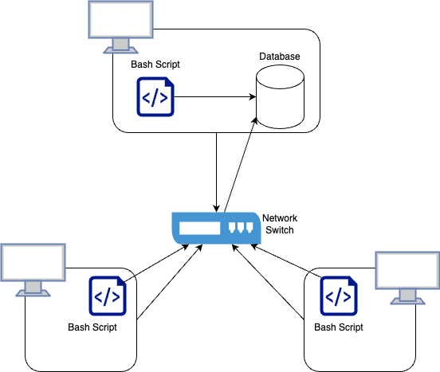

# Linux Cluster Monitoring Agent
## Introduction
The Linux Cluster Monitoring Agent records the hardware specifications of each node, monitors node resource usage in real time, and updates all information in a database. The agent continuously updates host usage, providing users with the latest data. Users can write simple SQL queries to retrieve the information they need. The Linux Cluster Administration team uses this resource to generate reports for future resource planning purposes. Technologies used include Linux, Bash, Docker, Git, PostgreSQL, Regex, and crontab.
## Quick Start
The following steps will get the Linux Cluster Monitoring Agent up and running with docker installed.
```
# Create a psql docker container with the given username and password
./scripts/psql_docker.sh create db_username db_password

# Start a psql instance using psql_docker.sh
./scripts/psql_docker.sh start

# Create tables using ddl.sql
psql -h localhost -U postgres -d host_agent -f sql/ddl.sql

# Insert hardware specs data into the DB using host_info.sh
bash scripts/host_info.sh psql_host psql_port db_name psql_user psql_password

# Insert hardware usage data into the DB using host_usage.sh
bash scripts/host_usage.sh psql_host psql_port db_name psql_user psql_password

# Crontab setup
crontab -e

# Add this to crontab
* * * * * bash [Absolute Path to host_usage.sh] host_address psql_port db_name db_username db_password > /tmp/host_usage.log
```
## Implementation
- Developed `psql_docker.sh` to simplify the process of managing the psql docker container
- Built `ddl.sql` file to automate the implementation of the database schema
- Created `host_info.sh` and `host_usage.sh` to insert hardware and usage data into the database
- Used `crontab` to schedule the process of collecting data by using `host_usage.sh` file
### Architecture

### Scripts
- `psql_docker.sh`: This script helps the user to manage the psql docker container.
```
# Create a psql docker container with the given username and password.
./scripts/psql_docker.sh create db_username db_password
# Start the stopped psql docker container
./scripts/psql_docker.sh start
# Stop the running psql docker container
./scripts/psql_docker.sh stop
```
- `host_info.sh`: This script will insert the hardware specifications of the node into the database.
```
# Insert hardware specs data into the DB using host_info.sh
bash scripts/host_info.sh psql_host psql_port db_name psql_user psql_password
```
- `host_usage.sh`: The script will insert the usage data of the machine into the database
```
# Insert hardware usage data into the DB using host_usage.sh
bash scripts/host_usage.sh psql_host psql_port db_name psql_user psql_password
```
- `crontab`: The script will run the host_usage.sh every minute, so it collects the data continuously.
```
# Crontab setup
crontab -e
# Add this to crontab
* * * * * bash [Absolute Path to host_usage.sh] host_address psql_port db_name db_username db_password > /tmp/host_usage.log
```
- `queries.sql`: 
### Database Modeling
`host_info`:
| id | hostname | cpu_number | cpu_architecture |             cpu_model          | cpu_mhz | l2_cache |        timestamp        | total_mem |
|----|----------|------------|------------------|--------------------------------|---------|----------|-------------------------|-----------|
| 1  |   noe1   |      1     |      x86_64      | Intel(R) Xeon(R) CPU @ 2.30GHz |   2300  |    256   | 2019-05-29 17:49:53.000 |   601324  |
- `id`: The table's primary key, auto increments.
- `hostname`: The name of the machine
- `cpu_number`: The number of the CPU on the machine
- `cpu_architecture`: The CPU architecture
- `cpu_model`: The CPU model
- `cpu_mhz`: The clock speed of the CPU
- `l2_cache`: The size of L2 cache in KB
- `timestamp`: Current time in UTC time zone
- `total_mem`: The size of total memory in KB

`host_usage`:
| timestamp | host_id | memory_free | cpu_idle |             cpu_kernel          | disk_io | disk_available |
|-----------|----------|------------|------------------|--------------------------------|---------|----------|
| 2019-05-29 17:49:53.000 |   1   |      300000     |      90      | 4 |   2  |    3   |
- `timestamp`: Current time in UTC time zone
- `host_id`: Host ID from host_info table
- `memory_free`: The size of free memory in MB
- `cpu_idle`: The percentage of CPU not being used by any program
- `cpu_kernel`: The percentage of CPU being used
- `disk_io`: Number of disk I/O
- `disk_available`: The size of the available disk of the root directory in MB
## Test
Testing was conducted by manually executing the bash scripts and DDL programs in the terminal. The program was verified by checking if the desired outcome was produced.
## Deployment
Deployment used Git for source code management and GitHub for version control. It also utilized Docker for provisioning a PostgreSQL instance and crontab for executing the script automatically.
## Improvements
- Handle hardware updates: Develop a function that can automatically detect and update the database's hardware information.
- Generate reports: Develop a feature to help users generate useful reports for resource planning and management purposes.
- Enhanced User Interface: Develop a web-based dashboard for visualizing real-time data, making it easier for users to monitor and analyze metrics.
